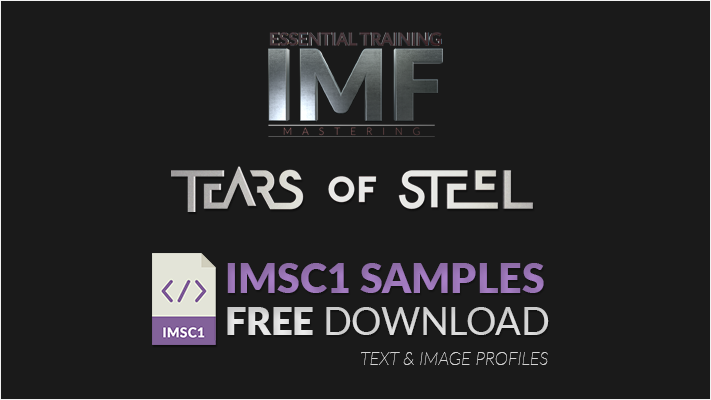

# TOS IMSC1 Sample Files



A colletcion of localised IMSC1 Timed Text files of the Blender Foundation's Open Movie Project Mango. Though it is known more commonly as '*Tears of Steel*'
https://mango.blender.org/

They are available in both **Text** and **Image** profiles for the following languages;

 - English (en)
 - French (fr)
 - German (de)
 - Italian (it)
 - Japanese (jp)
 - Spanish (es)

## Reference

https://www.w3.org/TR/ttml-imsc1.1/

## Target

Target Base Version
```sh
CPL:	CPL_7d020735-2d4b-447a-a02e-2460f9fe0d71.xml
UUID:	7d020735-2d4b-447a-a02e-2460f9fe0d71
```

Download:

```sh
[http://training.trenchdigital.net/resources](http://training.trenchdigital.net/resources)
```

## Meta


Distributed under the BSD 2-Clause License license. See ``LICENSE`` for more information.

ALL DOCUMENTS, INFORMATION AND CONTENT DISTRIBUTED HEREIN IS PROVIDED AS IS AND INTENDED FOR EDUCATIONAL PURPOSES ONLY AND SHOULD IN NO WAY BE USED AS A REFERENCE FOR IMPLEMENTING PRODUCTS. 

USE AT YOUR OWN RISK.

[Github](https://github.com/trenchdigital) | [Website](https://trenchdigital.net) | [Contact](https://trenchdigital.net#contact)

